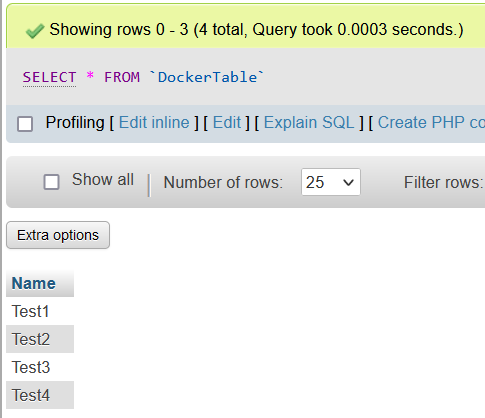

## TP1 Docker

### Exercice 5

**a**. Récupérer l’image sur le Docker Hub :  
`docker pull nginx`

**b**. Vérifier que cette image est présente en local :  
`docker images | grep nginx`

**c**. Créer un fichier index.html simple :  
`touch index.html && echo "<h1>Hello world!</h1>" > index.html`

**d**. Démarrer un conteneur et servir la page html créée précédemment à l’aide d’un volume :  
`docker run --name my_nginx -p 8080:80 -v ${PWD}/index.html:/usr/share/nginx/html/index.html -d nginx`

--name : nom du conteneur  
-p : expose le port 8080 de ma machine vers le port 80 du conteneur  
-d : mode détachée

**e**. Supprimer le conteneur précédent et arriver au même résultat que précédemment à l’aide de la commande docker cp  
`docker container rm -f my_nginx`  
`docker run -p 8080:80 --name my_nginx -d nginx`  
`docker cp index.html nginx:/usr/share/nginx/html/`

### Exercice 6

**a**. A l’aide d’un Dockerfile, créer une image  
`touch Dockerfile`

Contenu du Dockerfile :  
`FROM nginx:latest`  
`COPY index.html /usr/share/nginx/html/`

`docker build -t my_nginx_image .`

**b**. Exécuter cette nouvelle image de manière à servir la page html (commande
docker run)  
`docker run --name my_nginx -d -p 8080:80 my_nginx_image`

**c**. Quelles différences observez-vous entre les procédures 5. et 6. ?

```
Le but de ces exercices et d'exécuter un serveur web dans un conteneur Docker.

Dans l'exercice 5, il n'est pas demandé de créer un Dockerfile, donc de créer une image personnalisé à partir de l'image de nginx.
Cela implique de devoir rajouter des étapes comme la copie du fichier html dans le conteneur ou d'utiliser des volumes.

Dans cet exercice, il est demandé de créer un Dockerfile, donc de créer une image personnalisé à partir de l'image de nginx.
Cela n'implique pas d'étapes supplémentaires, car j'ai inclus la copie des fichiers dans l'image personnalisé.
```

### Exercice 7

**a**. Récupérer les images mysql:5.7 et phpmyadmin/phpmyadmin depuis le Docker Hub  
`docker pull mysql:5.7`
`docker pull  phpmyadmin/phpmyadmin`

**b**. Exécuter deux conteneurs à partir des images et ajouter une table ainsi que quelques enregistrements dans la base de données à l’aide de phpmyadmin  
`docker run --name mysql -e MYSQL_ROOT_PASSWORD=test -d mysql:5.7`  
`docker run --name phpmyadmin -d --link mysql:db -p 8080:80 phpmyadmin/phpmyadmin`  


### Exercice 8

**a**. Qu’apporte le fichier docker-compose par rapport aux commandes docker run ? Pourquoi est-il intéressant ? (cf. ce qui a été présenté pendant le cours)

`touch docker-compose.yml`

```
services:
  db:
    container_name: mysql
    image: mysql:5.7
    environment:
      MYSQL_ROOT_PASSWORD: test
    volumes:
      - ./createTableAndInsert.sql:/docker-entrypoint-initdb.d/createTableAndInsert.sql
  phpmyadmin:
    container_name: phpmyadmin
    image: phpmyadmin/phpmyadmin
    depends_on:
      - db
    ports:
      - 8080:80
```

```
Le fichier docker-compose permet la création d'une configuration pour plusieurs conteneurs, alors que la commande run permet d'executer qu'un seul conteneur.
```

**b**. Quel moyen permet de configurer (premier utilisateur, première base de données, mot de passe root, ...) facilement le conteneur mysql au lancement ?  
`touch createTableAndInsert.db`

```
CREATE DATABASE DockerTable;
USE DockerTable;
CREATE TABLE Table ('name' varchar(255));
INSERT INTO 'Table' ('name') VALUES ('test1');
INSERT INTO 'Table' ('name') VALUES ('test2');
INSERT INTO 'Table' ('name') VALUES ('test3');
INSERT INTO 'Table' ('name') VALUES ('test4');
```

`Lors du premier lancement du conteneur, les fichiers de scripts (.sql) se trouvant dans : /docker-entrypoint-initdb.d. seront exécutés automatiquement.`

